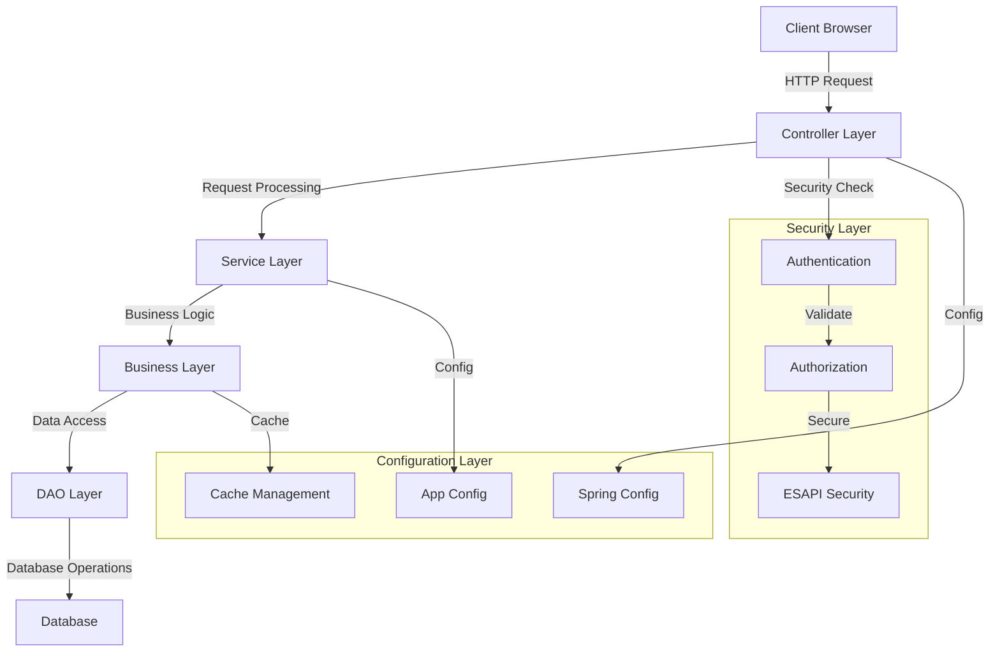
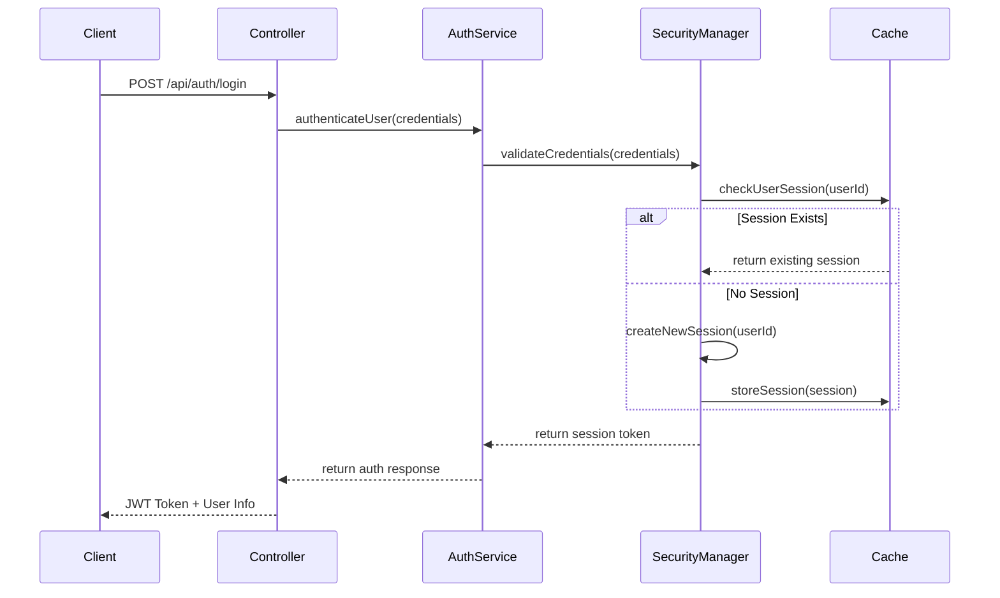
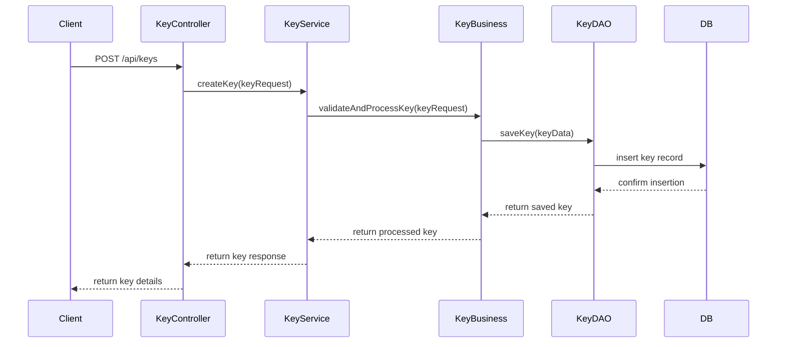
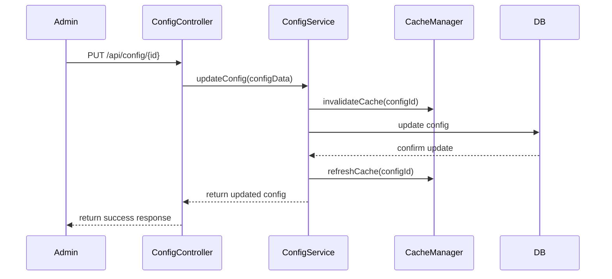
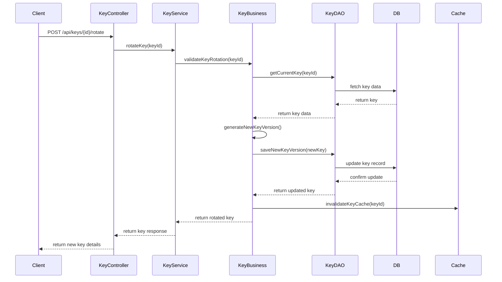
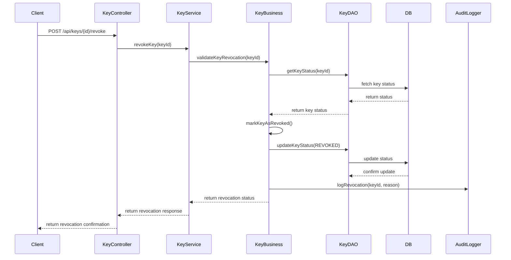
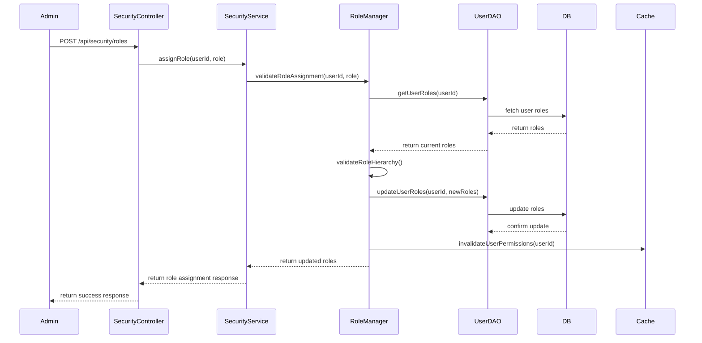
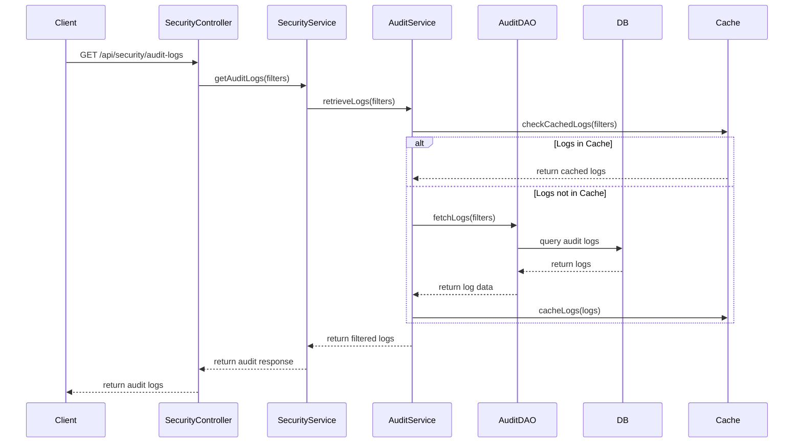

# KMC (Key Management Console)

## Overview
KMC is a Spring-based web application that provides a comprehensive key management console. The application is built using Spring MVC architecture and follows a layered design pattern.

## Technology Stack
- Spring Framework 5.2.22
- Hibernate 5.4.25
- Log4j 2.17.1
- Jackson 2.13.2
- ESAPI 2.3.0.0
- Maven

## Project Structure
```
kmc/
├── src/
│   └── main/
│       ├── java/
│       │   └── com/
│       │       └── key/
│       │           └── kmc/
│       │               ├── controller/    # Web controllers
│       │               ├── service/       # Business services
│       │               ├── dao/          # Data access objects
│       │               ├── data/         # Data models
│       │               ├── business/     # Business logic
│       │               ├── security/     # Security components
│       │               ├── config/       # Configuration
│       │               ├── util/         # Utility classes
│       │               └── soa/          # Service-oriented architecture components
│       └── webapp/      # Web resources
```

## Application Architecture Overview


## Detailed Application Flows

### 1. Authentication Flow


### 2. Key Management Flow


### 3. Configuration Management Flow


### 4. Key Rotation Flow


### 5. Key Revocation Flow


### 6. Role Management Flow


### 7. Audit Logging Flow


## API Endpoints

### Authentication Endpoints
- `POST /api/auth/login` - User authentication
- `POST /api/auth/logout` - User logout
- `GET /api/auth/validate` - Validate session token
- `POST /api/auth/refresh` - Refresh authentication token

### Key Management Endpoints
- `GET /api/keys` - List all keys
- `POST /api/keys` - Create new key
- `GET /api/keys/{id}` - Get key details
- `PUT /api/keys/{id}` - Update key
- `DELETE /api/keys/{id}` - Delete key
- `POST /api/keys/{id}/rotate` - Rotate key
- `POST /api/keys/{id}/revoke` - Revoke key

### Configuration Endpoints
- `GET /api/config` - Get all configurations
- `GET /api/config/{id}` - Get specific configuration
- `POST /api/config` - Create new configuration
- `PUT /api/config/{id}` - Update configuration
- `DELETE /api/config/{id}` - Delete configuration

### Security Endpoints
- `GET /api/security/audit-logs` - Get security audit logs
- `POST /api/security/validate-input` - Validate input data
- `GET /api/security/roles` - Get user roles
- `POST /api/security/roles` - Assign roles

## Key Components

### 1. Controller Layer
- Handles HTTP requests
- Manages request/response flow
- Implements REST endpoints
- Validates input data
- Routes requests to appropriate services
- Handles response formatting

### 2. Service Layer
- Implements business operations
- Manages transactions
- Coordinates between different components
- Handles complex business logic
- Implements caching strategies
- Manages service-level security

### 3. Business Layer
- Contains core business rules
- Implements domain logic
- Manages business validations
- Coordinates with services
- Handles business-level security
- Implements business workflows

### 4. DAO Layer
- Handles database operations
- Implements data access patterns
- Manages entity relationships
- Provides data persistence
- Implements query optimization
- Handles database transactions

### 5. Security Layer
- Implements authentication
- Manages authorization
- Provides ESAPI security features
- Handles security validations
- Manages session security
- Implements audit logging

### 6. Configuration Layer
- Manages Spring configuration
- Handles application properties
- Implements caching mechanisms
- Manages system settings
- Handles environment-specific configs
- Manages feature flags

## Getting Started

### Prerequisites
- Java JDK 8 or higher
- Maven 3.6 or higher
- Web Application Server (e.g., Tomcat, WebSphere)

### Building the Project
```bash
mvn clean install
```

### Running the Application
1. Deploy the generated WAR file to your web application server
2. Configure the application properties in `kmc-properties`
3. Start the application server

## Security Features
- ESAPI security implementation
- Authentication and authorization
- Input validation
- XSS protection
- CSRF protection
- Secure session management
- Role-based access control
- Audit logging
- Secure password handling
- API security

## Caching
The application implements caching mechanisms for:
- Application configuration
- User sessions
- Frequently accessed data
- System settings
- Key metadata
- User permissions
- Role mappings
- Audit logs

## Logging
- Comprehensive logging using Log4j2
- Different log levels for different environments
- Audit logging for security events
- Performance monitoring logs
- Error tracking
- Access logs
- Security audit trails
- System health monitoring

## Contributing
Please read CONTRIBUTING.md for details on our code of conduct and the process for submitting pull requests.

## License
This project is licensed under the [License Name] - see the LICENSE.md file for details 
